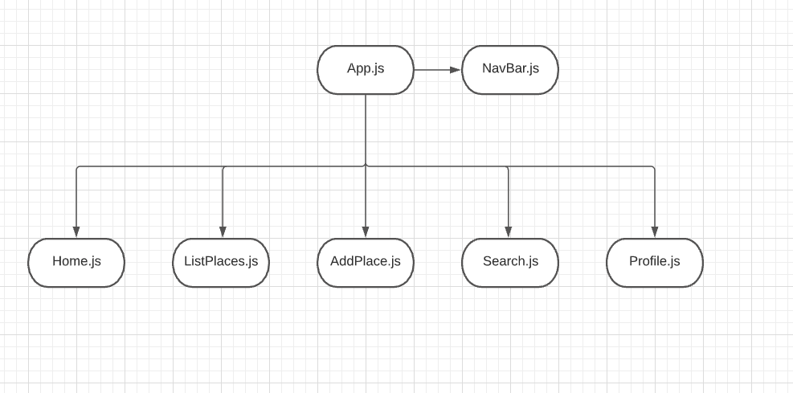
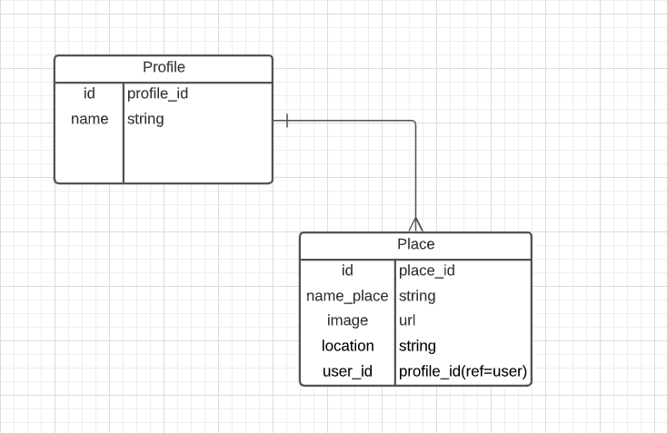

# Vegrestaurants

## Date: 8/30/2021

### By: Svetlana Shirapova
[Facebook](https://www.facebook.com/) | [GitHub ](https://github.com/SvetLana203/Traveling) | [LinkedIn](https://www.linkedin.com/in/svetlana-shirapova-aa9068219/)

***Decription***

This app will help users to find  healthy and vegetarian/vegan restaraunt and also the users can add their favorite places.

***Technologies***
* React.js
* Node.js
* Express
* MongoDB
* Mongoose

***Getting Started***

A Trello board was used to keep track of development progress and can be viewed
[here](https://trello.com/b/I2Yit0t4/vegrestaurants)

The project was deployed on Heroku and can be viewed [here](https://mighty-headland-53603.herokuapp.com/)

***Screenshots***

***Future Updates***

- [] Add UPDATE function
- [] Add SEARCH field
- [] Add feautures: user will be able to add comments, collect favorite places.
- [] Upgrade CSS styling
- [] Add USER account

***Credits***

Code: Lessons GA/Unit2

Nabila Ayaba

Andre Pato

Sam Bassong

[Google Maps](https://www.google.com/maps)

Color: [Coolors](https://coolors.co/palettes/popular)